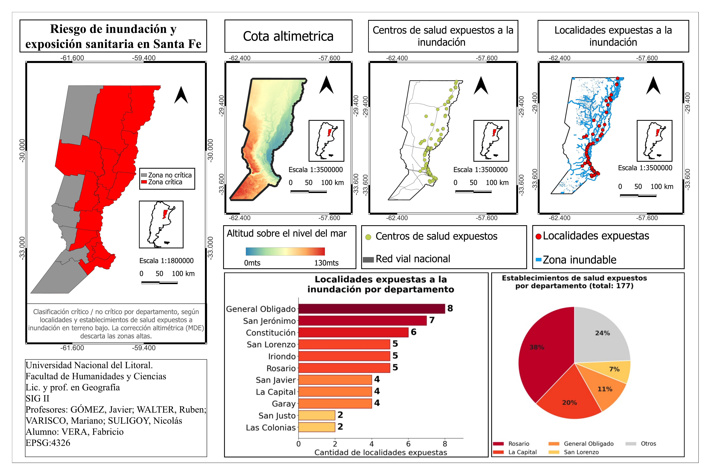

# Flood Risk and Health Infrastructure Exposure in Santa Fe, Argentina

GIS analysis of flood exposure across the province of Santa Fe (Argentina), combining hydrographic proximity analysis with digital elevation modeling to identify critical departments where populations and health facilities face real flood risk.

**Author:** Fabricio Vera — Geography, Universidad Nacional del Litoral (FHUC-UNL)
**Course:** Geographic Information Systems II — July 2026

## Objective

Map where physical flood hazard overlaps with exposed populations and critical health infrastructure, producing a department-level criticality index to support risk management and public awareness.

## Data sources

All data from Argentina's National Geographic Institute (IGN):

| Layer | Type | Source |
|---|---|---|
| Provincial and departmental boundaries | Vector (polygons) | IGN SIG layers |
| Localities (BAHRA settlements database) | Vector (points) | IGN |
| Hydrographic network and water bodies | Vector (lines/polygons) | IGN |
| National road network | Vector (lines) | IGN |
| Health facilities | Vector (points) | IGN |
| Digital Elevation Model (MDE-Ar, 30 m) | Raster | IGN |

CRS: WGS 84 (EPSG:4326).

## Methodology (QGIS)

1. **Layer preparation** — clipped national layers to the provincial boundary; filtered the 19 Santa Fe departments by attribute selection.
2. **Flood zone delimitation** — 2 km buffer around the hydrographic network and water bodies, merged into a single flood-prone zone.
3. **Exposure analysis** — selection by location to identify localities and health facilities intersecting the flood zone; point-in-polygon counts per department.
4. **Elevation correction** — the distance-only approach overestimated exposure, so the MDE-Ar raster was merged, clipped, and analyzed with the raster calculator. A low-terrain threshold of ~65 m (mean + 1 SD of elevation within the flood zone, covering ~84% of the flood-prone surface) was used to reclassify the DEM into a binary mask, discarding exposure located on high ground.
5. **Criticality index** — normalized composite index (0–1) per department combining exposed localities and exposed health facilities, recalculated after elevation correction.

## Key results

- 177 health facilities exposed provincewide; Rosario concentrates 38% of them.
- General Obligado (8), San Jerónimo (7), and Constitución (6) lead in exposed localities.
- Elevation correction reclassified several departments from critical to non-critical, showing why distance-to-river alone overestimates flood risk in high-terrain areas.

## Repository contents

- `poster/` — final cartographic poster (4 maps + charts).
- `docs/memoria_metodologica.pdf` — full methodological report (in Spanish, 18 pages).

## Tools

QGIS (geoprocessing, raster analysis, map composition) · IGN open data
